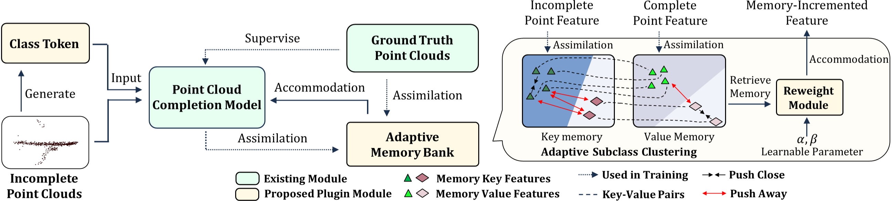
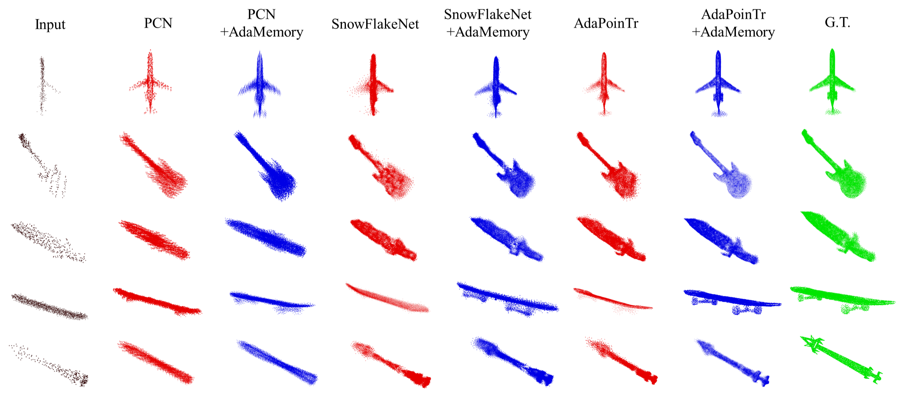

# AdaMemory: Rethinking the Bridge Between Incomplete and Complete Points in Point Cloud Completion Task

This repository contains PyTorch implementation for __AdaMemory: Rethinking the Bridge Between Incomplete and Complete Points in Point Cloud Completion Task__.

AdaMemory is a plug-and-play module designed to enhance the connection between incomplete point cloud inputs and complete point cloud supervision in point cloud completion tasks. Traditional methods often focus on optimizing the latent space through an encoder-maxpooling-decoder-supervision sequence, which overlooks the beneficial influence of complete point clouds. AdaMemory introduces an **"assimilation-accommodation"** mechanism, where an adaptive memory bank stores latent features from both incomplete and complete point clouds. It also employs an adaptive subclass clustering strategy to reduce intra-class variance. During the accommodation stage, the module extracts and enhances latent features from incomplete point clouds, using a class tokenizer for superior information extraction and an adaptive re-weight strategy to improve model robustness and zero-shot capabilities. This approach offers a fresh perspective on point cloud completion, demonstrating significant performance gains across multiple benchmark datasets.



### Pretrained Models
We offer the pretrained models on three established methods across four datasets:

- [AdaMemory Pre-trained Models](https://drive.google.com/drive/folders/1a9yvG4pvFg9ZOT9T41a2E2hncwSQc62y)


### Requirements

- PyTorch >= 1.7.0
- python >= 3.7
- CUDA >= 9.0
- GCC >= 4.9 
- torchvision
- timm
- open3d
- tensorboardX

```
pip install -r requirements.txt
```

#### Building Pytorch Extensions for Chamfer Distance, PointNet++ and kNN

*NOTE:* PyTorch >= 1.7 and GCC >= 4.9 are required.

```
# Chamfer Distance
bash install.sh
```

```
# PointNet++
pip install "git+https://github.com/erikwijmans/Pointnet2_PyTorch.git#egg=pointnet2_ops&subdirectory=pointnet2_ops_lib"
# GPU kNN
pip install --upgrade https://github.com/unlimblue/KNN_CUDA/releases/download/0.2/KNN_CUDA-0.2-py3-none-any.whl
```

Note: If you still get `ModuleNotFoundError: No module named 'gridding'` or something similar then run these steps

```
    1. cd into extensions/Module (eg extensions/gridding)
    2. run `python setup.py install`
```

That will fix the `ModuleNotFoundError`.


### Evaluation

To evaluate a pre-trained AdaMemory model on the Three Dataset with single GPU, run:

```shell
python main_memory.py --test \
    --config <config> \
    --ckpts <path> \
    --keys 1 --values 1 \
    [--mode <easy/median/hard>] \
    [--exp_name <exp_name>]
```

where the options "--keys 1 --values 1" do not have any actual meaning; they only serve as placeholders. To maintain the stability of the code and model structure, we need to input these two variables during the inference stage.

####  Some examples:
Test the AdaMemory+AdaPoinTr pretrained model on ShapeNet55 benchmark (*easy* mode):
```shell
python main_memory.py --test \
    --config cfgs/ShapeNet55_models/AdaMemory_AdaPoinTr.yaml \
    --ckpts ./pretrained/AdaMemory_AdaPoinTr_ShapeNet55.pth \
    --mode easy \
    --exp_name example
```



### Training

To train a point cloud completion model from scratch, run:

```shell
# Use DistributedDataParallel (DDP)
bash ./scripts/dist_train_adamemory.sh <NUM_GPU> <port> \
    --config <config> \
    --exp_name <name> \
    [--resume] \
    [--start_ckpts <path>] \
    [--val_freq <int>]
```

####  Some examples:
Train a AdaMemory+PoinTr model on ShapeNet-55 benchmark with 4 gpus:
```shell
CUDA_VISIBLE_DEVICES=0,1,2,3 bash ./scripts/dist_train_adamemory.sh 4 13232 --config ./cfgs/ShapeNet55_models/AdaMemory_AdaPoinTr.yaml --exp_name example
```
Resume a checkpoint:
```shell
CUDA_VISIBLE_DEVICES=0,1,2,3 bash ./scripts/dist_train_adamemory.sh 4 13232 --config ./cfgs/ShapeNet55_models/AdaMemory_AdaPoinTr.yaml --exp_name example --resume
```

We also provide multi-node, multi-GPU training scripts.

If you have 2 machines
On the first machine:
```shell
NNODES=2 NODE_RANK=0 PORT=<MASTER_PORT> MASTER_ADDR=<MASTER_ADDR> ./scripts/multi_machine_train_adamemory.sh <config> <gpus> <exp_name>
```
On the second machine:
```shell
NNODES=2 NODE_RANK=1 PORT=<MASTER_PORT> MASTER_ADDR=<MASTER_ADDR> ./scripts/multi_machine_train_adamemory.sh <config> <gpus> <exp_name>
```

For example, if you have 2 machines, each with 4 GPUs.
```shell
NNODES=2 NODE_RANK=0 PORT=30000 MASTER_ADDR=10.0.0.6 bash ./scripts/multi_machine_train_adamemory.sh cfgs/ShapeNet55_models/AdaMemory_AdaPoinTr.yaml 4 example

NNODES=2 NODE_RANK=1 PORT=30000 MASTER_ADDR=10.0.0.6 bash ./scripts/multi_machine_train_adamemory.sh cfgs/ShapeNet55_models/AdaMemory_AdaPoinTr.yaml 4 example
```

## License
MIT License

## Acknowledgements

Some of the code of this repo is borrowed from: 
- [PCN](https://github.com/wentaoyuan/pcn/tree/master)
- [SnowFlakeNet](https://github.com/AllenXiangX/SnowflakeNet/tree/main)
- [PoinTr](https://github.com/yuxumin/PoinTr)
- [ChamferDistancePytorch](https://github.com/ThibaultGROUEIX/ChamferDistancePytorch)


We thank the authors for their great job!
