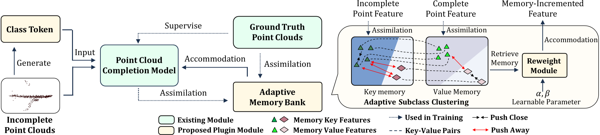

# AdaMemory

Official PyTorch implementation for **Rethinking the Bridge Between Incomplete and Complete Points in Point Cloud Completion Task**.

AdaMemory is a plug-and-play memory module for point cloud completion. This v2 release contains the label-free main experiment code: category labels are not used by the class tokenizer or memory clustering during training. Ablation and sensitivity configurations are intentionally omitted from this release.



## Requirements

- Python >= 3.7
- PyTorch >= 1.7.0
- CUDA >= 9.0
- GCC >= 4.9

Install Python dependencies:

```bash
pip install -r requirements.txt
```

Build CUDA extensions:

```bash
bash install.sh
```

Install PointNet++ and kNN dependencies:

```bash
pip install "git+https://github.com/erikwijmans/Pointnet2_PyTorch.git#egg=pointnet2_ops&subdirectory=pointnet2_ops_lib"
pip install --upgrade https://github.com/unlimblue/KNN_CUDA/releases/download/0.2/KNN_CUDA-0.2-py3-none-any.whl
```

If an extension import fails, enter the corresponding directory under `extensions/` and run:

```bash
python setup.py install
```

## Evaluation

Evaluate a checkpoint with:

```bash
python main_memory.py --test \
    --config cfgs/Projected_ShapeNet55_models/AdaMemory_AdaPoinTr.yaml \
    --ckpts /path/to/checkpoint.pth \
    --keys 1 --values 1 \
    --exp_name eval_adamemory_v2
```

The `--keys 1 --values 1` arguments are placeholders kept for compatibility with the memory runner. In v2, the learned memory bank is loaded from the model checkpoint.

## Training

Train with DistributedDataParallel:

```bash
CUDA_VISIBLE_DEVICES=0,1,2,3 bash ./scripts/dist_train_adamemory.sh 4 13232 \
    --config cfgs/Projected_ShapeNet55_models/AdaMemory_AdaPoinTr.yaml \
    --exp_name adapointr_adamemory_v2
```

Resume training:

```bash
CUDA_VISIBLE_DEVICES=0,1,2,3 bash ./scripts/dist_train_adamemory.sh 4 13232 \
    --config cfgs/Projected_ShapeNet55_models/AdaMemory_AdaPoinTr.yaml \
    --exp_name adapointr_adamemory_v2 \
    --resume
```

Multi-node training:

```bash
NNODES=2 NODE_RANK=0 PORT=30000 MASTER_ADDR=<MASTER_ADDR> \
    bash ./scripts/multi_machine_train_adamemory.sh cfgs/Projected_ShapeNet55_models/AdaMemory_AdaPoinTr.yaml 4 adapointr_adamemory_v2

NNODES=2 NODE_RANK=1 PORT=30000 MASTER_ADDR=<MASTER_ADDR> \
    bash ./scripts/multi_machine_train_adamemory.sh cfgs/Projected_ShapeNet55_models/AdaMemory_AdaPoinTr.yaml 4 adapointr_adamemory_v2
```

## Main Results

Projected-ShapeNet results use CD-L1 multiplied by 1000 and F-Score@1%. Each cell shows `baseline -> +AdaMemory`.

| Dataset | Backbone | F-Score@1% | CD-L1 |
| --- | --- | ---: | ---: |
| Projected-ShapeNet-55 | PCN | 40.3 -> 47.1 | 16.64 -> 14.02 |
| Projected-ShapeNet-55 | SnowFlakeNet | 59.4 -> 63.0 | 11.34 -> 10.49 |
| Projected-ShapeNet-55 | AdaPoinTr | 70.1 -> 71.5 | 9.58 -> 9.44 |
| Projected-ShapeNet-55 | FSC | 63.1 -> 64.8 | 10.75 -> 10.37 |

Projected-ShapeNet-34 reports seen and unseen splits.

| Backbone | Seen F-Score | Seen CD-L1 | Unseen F-Score | Unseen CD-L1 |
| --- | ---: | ---: | ---: | ---: |
| PCN | 43.2 -> 49.0 | 15.53 -> 13.40 | 30.7 -> 36.3 | 21.44 -> 17.90 |
| SnowFlakeNet | 61.6 -> 62.9 | 10.69 -> 10.37 | 55.1 -> 55.6 | 12.82 -> 12.65 |
| AdaPoinTr | 72.1 -> 72.3 | 9.12 -> 9.01 | 64.2 -> 65.2 | 11.37 -> 11.14 |
| FSC | 58.9 -> 63.1 | 11.39 -> 10.53 | 51.2 -> 54.5 | 14.03 -> 13.18 |

ShapeNet results use averaged F-Score@1% and CD-L2 across difficulty settings.

| Dataset | Backbone | F-Score@1% | CD-L2 |
| --- | --- | ---: | ---: |
| ShapeNet-55 | PCN | 13.3 -> 16.4 | 2.66 -> 2.23 |
| ShapeNet-55 | SnowFlakeNet | 39.8 -> 42.0 | 1.24 -> 0.96 |
| ShapeNet-55 | AdaPoinTr | 40.2 -> 40.8 | 0.81 -> 0.83 |
| ShapeNet-55 | FSC | 39.4 -> 40.8 | 0.96 -> 0.90 |

ShapeNet-34 reports seen and unseen splits.

| Backbone | Seen F-Score | Seen CD-L2 | Unseen F-Score | Unseen CD-L2 |
| --- | ---: | ---: | ---: | ---: |
| PCN | 15.4 -> 18.6 | 2.22 -> 1.93 | 10.1 -> 12.0 | 3.85 -> 3.78 |
| SnowFlakeNet | 42.2 -> 43.0 | 0.99 -> 0.87 | 38.8 -> 39.4 | 1.75 -> 1.64 |
| AdaPoinTr | 40.7 -> 41.3 | 0.78 -> 0.74 | 37.0 -> 37.6 | 1.24 -> 1.26 |
| FSC | 38.3 -> 41.2 | 0.97 -> 0.87 | 31.4 -> 36.2 | 1.88 -> 1.85 |

KITTI is evaluated with Fidelity and MMD because complete ground-truth point clouds are unavailable.

| Method | Fidelity | MMD |
| --- | ---: | ---: |
| AdaPoinTr+AdaMemory | 0.001 | 0.380 |
| SPAC-Net+AdaMemory | 0.000 | 0.451 |

## Trained checkpoints
[Google Drive](https://drive.google.com/drive/folders/1xRgqA_kE7NISWCyZHgrmNMm1Y6k7Xo2m?usp=drive_link)

## Acknowledgements

This repository builds on code from:

- [PCN](https://github.com/wentaoyuan/pcn/tree/master)
- [SnowFlakeNet](https://github.com/AllenXiangX/SnowflakeNet/tree/main)
- [PoinTr](https://github.com/yuxumin/PoinTr)
- [ChamferDistancePytorch](https://github.com/ThibaultGROUEIX/ChamferDistancePytorch)

## License

MIT License
